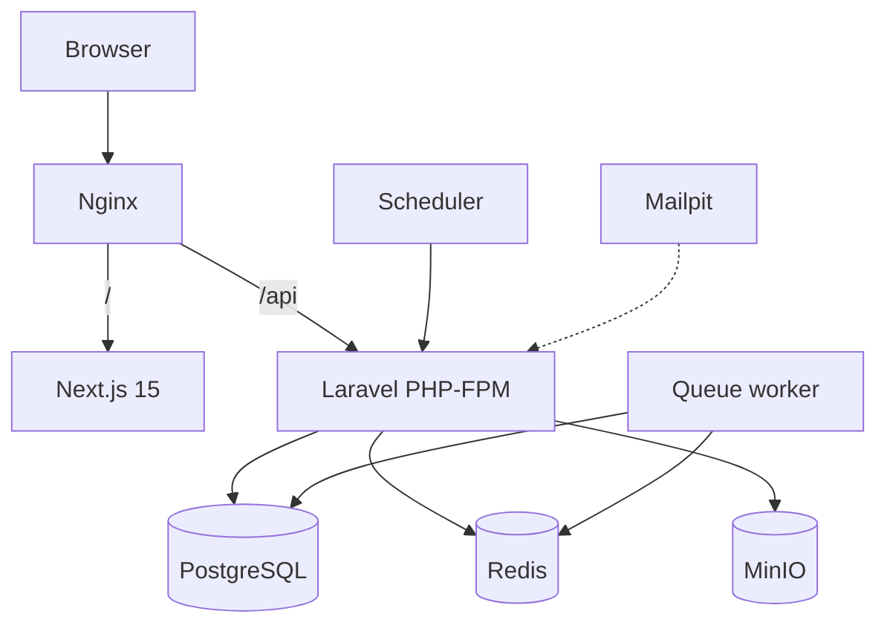

# SOKO-OS DEVELOPER HANDBOOK

> **Soko-OS** — The Operating System for African Businesses  
> **Soko POS** — Fast, Offline-First Point of Sale for African Businesses

This handbook is the entry point. Detailed build steps live in [developer-guide.md](./developer-guide.md). Honest progress lives in [implementation-status.md](./implementation-status.md).

---

## 1. What this is

Soko-OS is a multi-module Africa-first business platform. Soko POS is the first product on that platform.

Design pillars:

- Offline-first POS (IndexedDB + Dexie + sync engine)
- Tax-aware / payment-aware / accounting-aware adapters
- Multi-tenant: Organization → Business → Branch → Terminal → Device
- Docker-first local development

## 2. Repository

You are inside the **existing** GitHub repository (`mcwachira/soko-os`). Never create a nested `.git`, never `git init` under `apps/` or `packages/`.

```text
soko-os/
├── apps/web                 # Next.js 15 — Soko POS UI
├── apps/backend             # Laravel 13 API (PHP-FPM in Docker)
├── packages/                # Shared TS packages (domain, offline, tax, …)
├── infrastructure/          # Docker, Nginx, Postgres init, scripts
├── docs/                    # This handbook and guides
├── docker-compose.yml
├── docker-compose.dev.yml
├── turbo.json
├── pnpm-workspace.yaml
└── package.json
```

> Note: Laravel lives at `apps/backend` (pnpm workspace `apps/*`) rather than a root `backend/` folder. Domain boundaries are unchanged.

## 3. Frontend stack

```text
apps/web/
├── Next.js 15 (App Router)
├── React 19
├── TypeScript (strict)
├── Tailwind CSS v4 (CSS-first config)
├── shadcn/ui (New York style, CSS variables)
├── next-themes (light / dark / system)
├── TanStack Query v5 (server state)
├── Dexie (offline-first IndexedDB)
└── Playwright (E2E tests)
```

Design tokens: Soko-OS palette in `src/app/globals.css` using oklch CSS variables.

## 4. Frontend Architecture



### Route Structure

```text
src/app/
├── layout.tsx                 # Root layout (ThemeProvider)
├── (marketing)/               # Public marketing pages
│   ├── layout.tsx             # Marketing nav + footer
│   ├── page.tsx               # Homepage
│   ├── about/page.tsx
│   ├── blog/page.tsx
│   ├── pricing/page.tsx
│   └── ...
└── (app)/                     # Authenticated application
    ├── layout.tsx             # App shell (sidebar + header)
    ├── dashboard/page.tsx     # Business dashboard
    ├── pos/page.tsx           # Point of Sale
    ├── products/page.tsx      # Product catalog
    ├── inventory/page.tsx     # Inventory management
    ├── customers/page.tsx     # Customer management
    ├── sales/page.tsx         # Sales transactions
    ├── reports/page.tsx       # Reports
    └── settings/page.tsx      # Settings
```

### Product Areas

The authenticated app is organized into four primary product areas:

- **Soko POS** — Point of sale, checkout, sales, orders, returns, shifts
- **Soko Commerce** — Products, inventory, customers, suppliers, purchasing
- **Soko Books** — Accounting, invoices, expenses, receivables, payables
- **Soko Insights** — Analytics, reports

### Navigation

- Marketing: `MarketingNav` + `MarketingFooter` in `(marketing)/layout.tsx`
- App: `AppLayout` with sidebar in `(app)/layout.tsx`
- Shared: Same design tokens, colors, typography, Neobrutalism style

### Component Architecture

- `components/ui/` — shadcn/ui primitives (single source of truth)
- `components/marketing/` — Marketing-specific components
- `components/shared/` — Reusable states (loading, empty, error, theme-toggle)
- `components/pos/` — POS-specific components (future)
- `components/commerce/` — Commerce-specific components (future)
- `components/books/` — Books-specific components (future)
- `components/insights/` — Insights-specific components (future)
- `components/settings/` — Settings-specific components (future)
- Removed: `src/ui/index.tsx` (duplicate with hardcoded colors)
- Removed: `packages/ui/` (stale package)
- Removed: Local duplicate mirrors in `src/` (api-client, domain-types, offline, sync, tax, utils, validation)

### Authentication

- Login page at `/login` with React Hook Form + Zod validation
- `AuthProvider` wraps the app in root layout
- Token persisted to both `localStorage` and cookies
- Next.js middleware protects `(app)` routes and redirects unauthenticated users to `/login`

For detailed structure, see [frontend/project-structure.md](./frontend/project-structure.md).

## 4. Local setup (summary)

```bash
cp .env.example .env
pnpm install
pnpm dev:up          # builds PHP image; starts full stack
pnpm db:migrate
# open http://localhost:8080
```

Host tools required: Node 22+, pnpm 11+, Docker, Docker Compose, Git.  
Host installs of PostgreSQL/Redis/Nginx/MinIO are **not** required.

## 5. Service URLs (default ports)

| Service | URL / port |
|---------|------------|
| Nginx (app + API) | http://localhost:8080 |
| Next.js direct | http://localhost:3001 |
| API health | http://localhost:8080/api/v1/health |
| Component showcase | http://localhost:3001/dev/components |
| Postgres | localhost:5437 |
| Redis | localhost:6382 |
| Mailpit UI | http://localhost:8026 |
| MinIO API | http://localhost:9002 |
| MinIO console | http://localhost:9003 (user/pass from `.env.example`) |

## 6. Where to go next

| Topic | Doc |
|-------|-----|
| Step-by-step build | [developer-guide.md](./developer-guide.md) |
| What is / isn't done | [implementation-status.md](./implementation-status.md) |
| Frontend foundation | [frontend/project-structure.md](./frontend/project-structure.md) |
| Tailwind v4 setup | [frontend/tailwind.md](./frontend/tailwind.md) |
| shadcn/ui setup | [frontend/shadcn.md](./frontend/shadcn.md) |
| Theming | [frontend/theming.md](./frontend/theming.md) |
| Design system | [frontend/design-system.md](./frontend/design-system.md) |
| Failures | [troubleshooting.md](./troubleshooting.md) |
| ADRs | [adr/](./adr/) (expanding) |

## 7. Status labels used in this project

| Label | Meaning |
|-------|---------|
| Implemented | Works in this repo as documented |
| Partially Implemented | Scaffold / incomplete behaviour |
| Planned | Designed, not built |
| Requires Credentials | Adapter exists; live calls need secrets |
| Requires Certification | Legal/provider certification still required |
