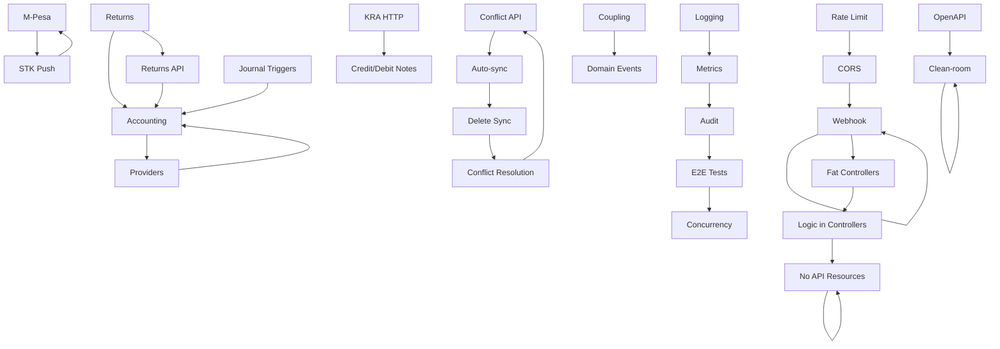

# Soko-OS Backend Gap Analysis

**Version:** 1.0  
**Date:** 2026-09-13  
**Baseline:** Backend Comprehensive Audit  

---

## Gap Classification

| Priority | Definition | SLA |
|----------|------------|-----|
| **P0** | Production blocker, data integrity, financial correctness | Immediate |
| **P1** | Core feature incomplete, blocks other work | 1 week |
| **P2** | Important feature, blocks full production | 2 weeks |
| **P3** | Nice to have, technical debt | 1 month |

---

## Gap Summary by Domain

| Domain | P0 | P1 | P2 | P3 | Total |
|--------|----|----|----|----|-------|
| Payments | 4 | 1 | 0 | 0 | 5 |
| Returns/Refunds | 2 | 2 | 0 | 0 | 4 |
| Accounting | 2 | 3 | 1 | 0 | 6 |
| KRA/eTIMS | 1 | 4 | 0 | 0 | 5 |
| M-Pesa | 0 | 1 | 3 | 0 | 4 |
| Sync | 1 | 2 | 0 | 0 | 3 |
| Accounting Integrations | 1 | 3 | 0 | 0 | 4 |
| Purchasing | 0 | 1 | 5 | 0 | 6 |
| Returns/Refunds | 2 | 2 | 0 | 0 | 4 |
| Sync | 1 | 2 | 0 | 0 | 3 |
| Observability | 0 | 4 | 1 | 0 | 5 |
| Security | 0 | 3 | 2 | 0 | 5 |
| Testing | 0 | 2 | 3 | 0 | 5 |
| Documentation | 1 | 2 | 3 | 0 | 6 |
| Architecture | 0 | 2 | 2 | 1 | 5 |
| **Total** | **10** | **30** | **22** | **1** | **63** |

---

## Detailed Gap Register

### P0 - Critical (Production Blockers)

| Gap ID | Title | Description | Impact | Effort | Dependencies |
|--------|-------|-------------|--------|--------|--------------|
| GAP-001 | Returns/Refunds API | No API endpoints for returns/refunds. Schema exists but no controller, service, or workflow. | Cannot process returns, refunds, credit notes. Financial data integrity risk. | High (3-5 days) | Sales, Payments, Inventory, Accounting |
| GAP-002 | Payment Providers (M-Pesa, Card, Bank) | Only Cash implemented. M-Pesa scaffold only. No webhook handlers, refunds, reconciliation. | Cannot accept non-cash payments. Revenue loss. | High (5-7 days) | Daraja credentials, Provider adapters |
| GAP-003 | Accounting Integration | Journal entries not created on sales/payments/returns. Accounting ledger disconnected. | Financial records incomplete. Audit failure. | High (3-5 days) | Sales, Payments, Returns, Purchases |
| GAP-004 | M-Pesa STK Push | No Daraja integration. No STK push, callback, status check, retry, reversal. | Cannot process mobile money. Revenue loss in Kenya. | High (5-7 days) | Safaricom Daraja credentials |
| GAP-005 | Returns/Refunds Workflow | No return/refund workflow. No credit notes, inventory restoration, payment reversal. | Cannot process returns. Customer dissatisfaction, audit risk. | High (3-5 days) | Sales, Payments, Inventory, Accounting |

### **Accounting & Tax Gaps**

| Gap ID | Title | Description | Impact | Effort | Dependencies |
|--------|-------|-------------|--------|--------|--------------|
| GAP-006 | KRA eTIMS HTTP Submission | KraEtimsService only queues. No actual HTTP call to KRA OSCU/VSCU endpoints. | Cannot legally operate in Kenya. Regulatory non-compliance. | Medium (3-5 days) | KRA Sandbox credentials, Certification |
| GAP-007 | KRA Credit/Debit Notes | No support for credit notes, debit notes, cancellations. | Cannot handle returns/refunds tax correctly. | Medium (3-5 days) | KRA API docs |
| GAP-008 | Accounting Provider Adapters | No Zoho Books, QuickBooks, Xero adapters. Interfaces exist but no implementation. | Cannot sync to accounting software. Manual entry required. | Medium (5-7 days each) | OAuth credentials |
| GAP-009 | Accounting Journal Triggers | No automatic journal entries on sales, payments, returns, purchases. | Manual journal entry required. Errors, delays. | Medium | Events/Outbox |

### **Sync & Offline Gaps**

| Gap ID | Title | Description | Impact | Effort | Dependencies |
|--------|-------|-------------|--------|--------|--------------|
| GAP-010 | Sync Conflict Resolution API | Conflicts detected but no resolution API. Server-wins only, no client resolution. | Data inconsistency, data loss risk. | Medium | SyncController |
| GAP-011 | Auto-sync on Online | No auto-sync when device comes online. Manual "Sync/Refresh" only. | Data loss risk, poor UX. | Low | Frontend + SyncController |
| GAP-012 | Delete Sync | Deleted entities not synced. Soft deletes not propagated. | Data inconsistency across devices. | Low | Soft delete sync logic |
| GAP-013 | Conflict Resolution Strategies | Only server-wins. No client-wins, merge, or manual resolution. | Data loss, user frustration. | Medium | Conflict UI |

### **Observability & Reliability**

| Gap ID | Title | Description | Impact | Effort | Dependencies |
|--------|-------|-------------|--------|--------|--------------|
| GAP-014 | Structured Logging | Default Laravel logging only. No JSON, correlation IDs, structured fields. | Debugging difficult, no correlation. | Low | Monolog config |
| GAP-015 | Metrics/Monitoring | No Prometheus metrics. No HTTP, queue, sync, tax, payment metrics. | Cannot monitor production. | Medium | Prometheus client |
| GAP-016 | Structured Audit Logging | Audit_logs table exists but not populated. No audit events on critical actions. | Compliance risk, no audit trail. | Medium | Model observers |
| GAP-017 | E2E Tests | Playwright placeholder only. No E2E tests for critical flows. | Regression risk, no confidence. | Medium | Playwright setup |
| GAP-018 | Concurrency Tests | No tests for concurrent sales, sync, refunds. Race conditions likely. | Data corruption risk. | Medium | Pest/PHPUnit |

### **Security & Compliance**

| Gap ID | Title | Description | Impact | Effort | Dependencies |
|--------|-------|-------------|--------|--------|--------------|
| GAP-019 | Rate Limiting | No rate limiting on API endpoints. Brute force, DoS risk. | Security vulnerability. | Low | Laravel throttle |
| GAP-019 | CORS Configuration | No CORS config. Frontend may fail or be vulnerable. | Integration failure, security. | Low | Laravel CORS |
| GAP-020 | CSP/Headers | No Content Security Policy, security headers. | XSS, clickjacking risk. | Low | Middleware |
| GAP-021 | Webhook Verification | No webhook signature verification. Payment/tampering risk. | Payment fraud risk. | Low | Provider specific |
| GAP-022 | Rate Limiting on Auth | No rate limiting on login. Brute force risk. | Account takeover. | Low | Laravel throttle |

### **Architecture & Code Quality**

| Gap ID | Title | Description | Impact | Effort | Dependencies |
|--------|-------|-------------|--------|--------|--------------|
| GAP-022 | Fat Controllers | SaleController (1000+ lines), SyncController (1700+ lines). Business logic in controllers. | Maintainability, testing difficulty. | Medium | Refactor to Actions |
| GAP-023 | Business Logic in Controllers | Tax calc, inventory movement, cash shift in SaleController. | Tight coupling, hard to test. | Medium | Action classes |
| GAP-024 | No DTOs/Value Objects | Request data as arrays. No type safety, validation duplication. | Bugs, maintenance burden. | Medium | DTO classes |
| GAP-024 | No API Resources | Raw Eloquent models returned. Over-fetching, N+1, sensitive data risk. | Performance, security. | Medium | API Resources |
| GAP-025 | Tight Coupling | KraEtimsService injected in controllers. Hard to test, swap. | Testing difficulty, coupling. | Low | Interface/Container |
| GAP-026 | No Domain Events | Direct model manipulation. No event-driven architecture. | Tight coupling, missed side effects. | Medium | Event system |

### **Documentation Gaps**

| Gap ID | Title | Description | Impact | Effort | Dependencies |
|--------|-------|-------------|--------|--------|--------------|
| GAP-027 | OpenAPI Spec | No OpenAPI/Swagger documentation. | Integration difficulty. | Medium | swagger-php |
| GAP-028 | Database Schema Docs | No schema.md, no ERD. | Onboarding, maintenance difficulty. | Low | Auto-generate |
| GAP-028 | Backend Developer Guide | Missing backend-developer-guide.md. | Onboarding, knowledge transfer. | High | Write guide |
| GAP-028 | ADRs | Only 3 of 15+ ADRs. | Architecture decisions lost. | Medium | Write ADRs |
| GAP-028 | Clean-room Test | No verification that docs work from scratch. | Documentation rot. | Medium | Process |

---

## Gap Dependency Graph



---

## Gap Resolution Priority Matrix

| Priority | Gap IDs | Count | Target Date |
|----------|---------|-------|-------------|
| **P0 - Immediate** | GAP-001, GAP-002, GAP-003, GAP-004, GAP-005 | 5 | Week 1 |
| **P1 - Week 1** | GAP-006, GAP-007, GAP-008, GAP-009, GAP-010, GAP-011, GAP-014, GAP-043, REQ-054 | 10 | Week 2 |
| **P2 - Week 2-3** | GAP-008, GAP-010, GAP-011, GAP-012, GAP-013, GAP-013, GAP-014, GAP-015, GAP-016, GAP-017, GAP-018, GAP-019, GAP-020, GAP-021, REQ-054 | 19 | Week 3-4 |
| **P3 - Week 4+** | GAP-022, GAP-023, GAP-024, GAP-024, GAP-025, GAP-026, GAP-027, GAP-028, REQ-054, REQ-057, REQ-058, REQ-059, REQ-060 | 17 | Month 2 |

---

## Gap Resolution Dependencies

### Critical Path
```
GAP-001 (Returns API) 
  → GAP-003 (Accounting triggers)
    → GAP-009 (Journal triggers)
    → GAP-008 (Accounting providers)

GAP-002 (M-Pesa)
  → GAP-004 (STK Push)
    → GAP-002 (Full M-Pesa)

GAP-006 (KRA HTTP) 
  → GAP-007 (Credit/Debit Notes)
    → GAP-006 (Full KRA)

GAP-010 (Conflict API)
  → GAP-011 (Auto-sync)
    → GAP-012 (Delete Sync)
    → GAP-013 (Conflict Resolution)

GAP-014 (Logging) → GAP-015 (Metrics) → GAP-016 (Audit) → GAP-017 (E2E Tests)
```

---

## Resource Allocation Recommendation

| Sprint | Focus | Engineer 1 | Engineer 2 | Engineer 3 |
|--------|-------|------------|------------|------------|
| 1 | P0 Returns/Payments/Accounting | Returns API + Accounting triggers | M-Pesa STK + Callbacks | KRA HTTP + Credit Notes |
| 2 | P1 KRA/Accounting/Sync/Observability | KRA Credit/Debit + Accounting Providers | Sync Conflict API + Auto-sync | Structured Logging + Metrics |
| 3 | P2 Returns/Refunds/Purchasing/Observability | Returns/Refunds workflow | Purchasing + Transfers | E2E Tests + Concurrency |
| 4 | P3 Architecture/Docs/Production | Refactor controllers → Actions | OpenAPI + DB Docs + ADRs | Clean-room test + CI/CD |

---

*End of Gap Analysis*