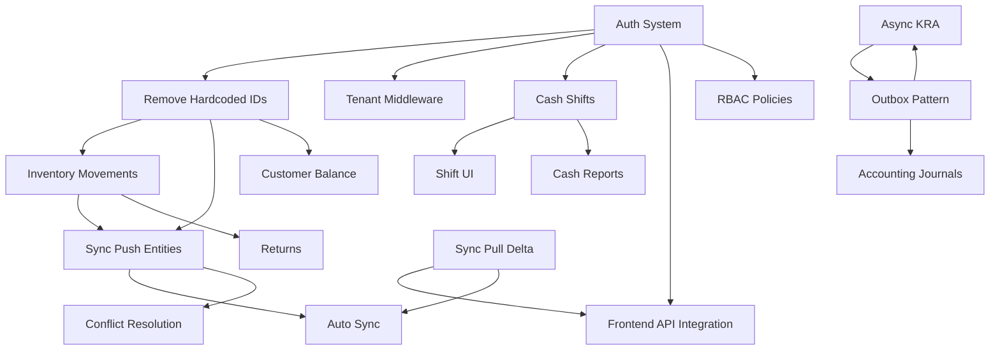

# Soko-OS Gap Analysis

**Generated from:** Comprehensive System Audit (2026-09-13)  
**Purpose:** Detailed breakdown of every gap with remediation plan

---

## Gap Classification

| Priority | Definition | SLA Target |
|----------|------------|------------|
| **P0** | Security vulnerability, data corruption, financial correctness, blocking infrastructure | Fix immediately |
| **P1** | Core business functionality required for MVP | Next 2-4 weeks |
| **P2** | Required functionality for production readiness | Next 4-8 weeks |
| **P3** | Advanced functionality, nice-to-have | Future phases |

---

## P0 Gaps (Critical - Must Fix First)

### GAP-001: Hardcoded Tenant IDs in Controllers
| Field | Value |
|-------|-------|
| **Requirement** | Multi-tenancy enforcement |
| **Current State** | `SaleController::store()` and `SyncController::push()` hardcode `organization_id`, `business_id`, `cashier_user_id` to `00000000-0000-0000-0000-000000000001` |
| **Problem** | All sales attributed to single org; cross-tenant data corruption; no real multi-tenancy |
| **Impact** | **Data corruption** — organizations see each other's data; financial reports wrong |
| **Required Change** | Extract tenant context from authenticated user/token; add tenant middleware |
| **Files Affected** | `SaleController.php:67-71`, `SyncController.php:60-64`, need new middleware |
| **Dependencies** | Authentication system (GAP-004) |
| **Priority** | **P0** |
| **Test Requirement** | Multi-tenant test: create sale as org A, verify org B cannot see it |
| **Documentation** | Update developer guide auth section |

---

### GAP-002: No Inventory Movements on Sale
| Field | Value |
|-------|-------|
| **Requirement** | Inventory ledger traceability |
| **Current State** | `SaleController::store()` and `SyncController::push()` create sale + items + payments but **no** `inventory_movements` records |
| **Problem** | Stock quantities never decrement; inventory untraceable; financial COGS impossible |
| **Impact** | **Financial incorrectness** — inventory valuation wrong, no audit trail |
| **Required Change** | Create `InventoryMovement` records for each sale item (movement_type='sale', quantity_change negative) |
| **Files Affected** | `SaleController.php`, `SyncController.php`, new `InventoryService` |
| **Dependencies** | Product stock validation (check available qty) |
| **Priority** | **P0** |
| **Test Requirement** | Sale of 5 units → inventory_movements has -5, balance_after correct |
| **Documentation** | Document inventory ledger pattern |

---

### GAP-003: No Tenant Isolation Middleware
| Field | Value |
|-------|-------|
| **Requirement** | Organization-level data isolation |
| **Current State** | Schema has `organization_id` FK on all tables but **no middleware** enforces scope |
| **Problem** | Any authenticated user could access any organization's data via ID manipulation |
| **Impact** | **Security breach** — cross-tenant data access |
| **Required Change** | Create `EnsureTenantAccess` middleware; apply to all API routes; scope queries to `auth()->user()->organization_id` |
| **Files Affected** | New middleware, `routes/api.php`, all controllers |
| **Dependencies** | Authentication (GAP-004) |
| **Priority** | **P0** |
| **Test Requirement** | User from org A requests org B resource → 403/404 |
| **Documentation** | Security architecture doc |

---

### GAP-004: No Authentication/Authorization System
| Field | Value |
|-------|-------|
| **Requirement** | Secure API access with user context |
| **Current State** | No login endpoint; no token issuance; Sanctum installed but unused; controllers use hardcoded user ID |
| **Problem** | No way to identify current user; no permissions; no audit trail of who did what |
| **Impact** | **Security** — anonymous access; **Audit** — no accountability |
| **Required Change** | Implement Sanctum token auth: `POST /api/v1/auth/login`, `POST /api/v1/auth/logout`, `GET /api/v1/auth/user`; add `auth:sanctum` middleware; create policies for Sale, Product, Customer, Shift |
| **Files Affected** | New `AuthController`, `routes/api.php`, `User` model (HasApiTokens), policies, middleware |
| **Dependencies** | None (foundational) |
| **Priority** | **P0** |
| **Test Requirement** | Login → token → access protected route; wrong token → 401; expired token → 401 |
| **Documentation** | Auth flow in developer guide |

---

### GAP-005: Sync Pull Returns All Data (No Delta)
| Field | Value |
|-------|-------|
| **Requirement** | Efficient incremental synchronization |
| **Current State** | `SyncController::pull()` returns ALL products, categories, customers unpaginated |
| **Problem** | O(N) bandwidth; fails at scale (10k+ products); no `since_cursor` filtering implemented |
| **Impact** | **Performance/scale failure** — mobile devices timeout, excessive bandwidth |
| **Required Change** | Implement cursor-based pagination; filter by `updated_at > since_cursor`; return `next_cursor` |
| **Files Affected** | `SyncController.php:155-170`, `SyncPullPayload` type, frontend sync engine |
| **Dependencies** | Cursor tracking in offline DB |
| **Priority** | **P0** |
| **Test Requirement** | Pull with cursor returns only changed records; cursor advances |
| **Documentation** | Sync protocol specification |

---

### GAP-006: Sync Push Only Handles sales.create
| Field | Value |
|-------|-------|
| **Requirement** | Full entity synchronization |
| **Current State** | `SyncController::push()` only processes `entity_name === 'sales' && action === 'create'` |
| **Problem** | Products, customers, inventory movements, cash shifts cannot sync from offline |
| **Impact** | **Offline broken** — only sales work offline; other data loss |
| **Required Change** | Add handlers for: `customers.create|update`, `inventory_movements.create`, `cash_shifts.create|update`, `products.update` (price changes) |
| **Files Affected** | `SyncController.php`, new handler classes |
| **Dependencies** | Inventory movements (GAP-002), Cash shifts (GAP-009) |
| **Priority** | **P0** |
| **Test Requirement** | Offline create customer → sync → server has customer |
| **Documentation** | Sync entity matrix |

---

### GAP-007: KRA Submission Synchronous in DB Transaction
| Field | Value |
|-------|-------|
| **Requirement** | Non-blocking tax fiscalization |
| **Current State** | Both `SaleController` and `SyncController` call `$kraService->fiscalizeSale($sale)` **inside** the DB transaction |
| **Problem** | Transaction holds locks during external HTTP call; timeout rolls back sale; KRA downtime = failed sales |
| **Impact** | **Availability** — KRA issues block checkout; **Data integrity** — sale rolled back on timeout |
| **Required Change** | Move fiscalization to async job: dispatch `FiscalizeSaleJob` after transaction commits; use outbox pattern |
| **Files Affected** | `SaleController.php:116`, `SyncController.php:109`, new Job, queue config |
| **Dependencies** | Queue worker (running), outbox pattern (GAP-023) |
| **Priority** | **P0** |
| **Test Requirement** | Sale commits even if KRA service unavailable; job retries |
| **Documentation** | Async integration pattern |

---

### GAP-008: No Form Requests / Validation Layer
| Field | Value |
|-------|-------|
| **Requirement** | Consistent, reusable validation |
| **Current State** | Inline `$request->validate()` in controllers; duplicated logic between SaleController and SyncController |
| **Problem** | Inconsistent validation; hard to test; duplication; no separation of concerns |
| **Impact** | **Maintainability** — bugs from divergent validation; **Security** — missed validation |
| **Required Change** | Create `StoreSaleRequest`, `SyncPushRequest`, `SyncPullRequest` form requests; move all validation rules there |
| **Files Affected** | New FormRequest classes, controllers |
| **Dependencies** | None |
| **Priority** | **P0** |
| **Test Requirement** | Invalid payload → 422 with correct messages; valid → passes |
| **Documentation** | Validation patterns guide |

---

### GAP-009: No Cash Shift Integration
| Field | Value |
|-------|-------|
| **Requirement** | Cash management per shift |
| **Current State** | `cash_shifts` table exists; sales have `shift_id` FK but controllers **never** link sale to active shift; no shift open/close API |
| **Problem** | Cash variance impossible; shift reports empty; no accountability |
| **Impact** | **Financial control failure** — cash reconciliation broken |
| **Required Change** | Add `ShiftController` with `open`, `close`, `current`; link sales to active shift for cashier; update shift totals on sale |
| **Files Affected** | New `ShiftController`, `routes/api.php`, `SaleController`, `SyncController` |
| **Dependencies** | Authentication (GAP-004) |
| **Priority** | **P0** |
| **Test Requirement** | Open shift → cash sale → close shift → expected_cash = opening + cash_sales - cash_out + cash_in - cash_refunds |
| **Documentation** | Cash management workflow |

---

### GAP-010: No Customer Balance Updates
| Field | Value |
|-------|-------|
| **Requirement** | Credit sales tracking |
| **Current State** | `customers.current_balance_minor` field exists but **never updated** on credit sales or payments |
| **Problem** | Credit balances stale; statements wrong; credit limit enforcement impossible |
| **Impact** | **Financial incorrectness** — receivables untracked |
| **Required Change** | On `payment_method === 'credit'`: increment `current_balance_minor`; on credit payment: decrement |
| **Files Affected** | `SaleController.php`, `SyncController.php`, new `CustomerService` |
| **Dependencies** | Credit payment method handling |
| **Priority** | **P0** |
| **Test Requirement** | Credit sale of 1000 → customer balance +1000; payment 500 → balance 500 |
| **Documentation** | Credit management guide |

---

### GAP-011: Frontend Has No Real API Integration
| Field | Value |
|-------|-------|
| **Requirement** | POS works online with server sync |
| **Current State** | `page.tsx` uses hardcoded `SAMPLE_PRODUCTS`; writes to IndexedDB only; "Sync/Refresh" button does nothing |
| **Problem** | POS is offline-only demo; no real catalog; no server persistence |
| **Impact** | **Not production usable** — data never reaches server |
| **Required Change** | Wire `@soko/api-client`; implement login flow; load products via sync pull on startup; push sales on checkout; auto-sync on online |
| **Files Affected** | `page.tsx`, new auth context, sync hook, product repository |
| **Dependencies** | Auth (GAP-004), Sync pull delta (GAP-005), Product API |
| **Priority** | **P0** |
| **Test Requirement** | Login → products load from server → sale → sync → server has sale |
| **Documentation** | Frontend architecture guide |

---

### GAP-012: No Background/Auto Sync
| Field | Value |
|-------|-------|
| **Requirement** | Seamless offline-first experience |
| **Current State** | Manual "Sync/Refresh" button only; no auto-sync on online; no periodic sync; no retry UI |
| **Problem** | User must remember to sync; data loss risk on browser close; poor UX |
| **Impact** | **Data loss risk** — unsynced sales; **UX failure** |
| **Required Change** | Implement `useSync` hook: auto-sync on `online` event; periodic sync (30s); exponential backoff on failure; sync status indicator |
| **Files Affected** | New `useSync.ts` hook, `page.tsx`, `@soko/sync` engine |
| **Dependencies** | Sync engine (GAP-005, GAP-006) |
| **Priority** | **P0** |
| **Test Requirement** | Offline sale → online → auto-sync within 5s → server verified |
| **Documentation** | Offline sync behavior |

---

### GAP-013: No Conflict Resolution in Sync
| Field | Value |
|-------|-------|
| **Requirement** | Data consistency across devices |
| **Current State** | `SyncController::push()` returns empty `conflicts` array; `OfflineSyncEngine` has stub `handleConflicts` |
| **Problem** | Concurrent edits on same entity (e.g., product price on 2 terminals) cause silent data loss |
| **Impact** | **Data divergence** — inconsistent state across devices |
| **Required Change** | Implement conflict detection: compare `version`/`updated_at`; resolution strategies: server-wins, client-wins, merge (for quantities); UI for manual resolution |
| **Files Affected** | `SyncController.php`, `OfflineSyncEngine.ts`, `@soko/offline` schema (add version), conflict UI |
| **Dependencies** | Optimistic locking (product version exists) |
| **Priority** | **P0** |
| **Test Requirement** | Two devices edit same product → sync → conflict detected → resolution applied |
| **Documentation** | Conflict resolution strategy |

---

### GAP-014: MinIO S3 Filesystem Not Wired
| Field | Value |
|-------|-------|
| **Requirement** | Object storage for receipts, imports, backups |
| **Current State** | MinIO running; Laravel `FILESYSTEM_DISK=local`; AWS env vars set but `league/flysystem-aws-s3-v3` not installed |
| **Problem** | File uploads use local disk (lost on container restart); no persistent storage |
| **Impact** | **Data loss** — uploaded files disappear on deploy |
| **Required Change** | `composer require league/flysystem-aws-s3-v3`; configure `filesystems.php` s3 disk; set `FILESYSTEM_DISK=s3` in Compose |
| **Files Affected** | `composer.json`, `config/filesystems.php`, `docker-compose.yml` |
| **Dependencies** | None |
| **Priority** | **P0** |
| **Test Requirement** | Upload file → visible in MinIO console → persists after container restart |
| **Documentation** | File storage config |

---

## P1 Gaps (Core Business Features)

### GAP-015: Product Catalog API + Sync Pull
| Field | Value |
|-------|-------|
| **Requirement** | Real product data in POS |
| **Current State** | No product API endpoints; POS uses hardcoded sample products |
| **Required Change** | `ProductController` with `index`, `show`; add to sync pull; pagination, search, barcode lookup |
| **Files Affected** | New `ProductController`, `routes/api.php`, `SyncController::pull()` |
| **Priority** | **P1** |

---

### GAP-016: Customer Search/Select in POS
| Field | Value |
|-------|-------|
| **Requirement** | Attach customer to sale |
| **Current State** | No customer API; POS has no customer selection UI |
| **Required Change** | `CustomerController` with search; POS customer picker modal; attach `customer_id` to sale |
| **Files Affected** | New `CustomerController`, POS UI components |
| **Priority** | **P1** |

---

### GAP-017: Shift Open/Close UI + Backend
| Field | Value |
|-------|-------|
| **Requirement** | Cashier shift lifecycle |
| **Current State** | Shift model + migration only; no API; no UI |
| **Required Change** | `ShiftController` (open/close/current); POS shift screen; opening float entry; close with actual count |
| **Files Affected** | New `ShiftController`, POS shift components |
| **Priority** | **P1** |

---

### GAP-018: Returns/Refunds Workflow
| Field | Value |
|-------|-------|
| **Requirement** | Post-sale corrections |
| **Current State** | `SaleStatus` has `refunded`/`partially_refunded`; no implementation |
| **Required Change** | `ReturnController`: create return sale items, process refund payment, update inventory (+), create credit note |
| **Files Affected** | New `ReturnController`, POS return flow |
| **Priority** | **P1** |

---

### GAP-019: Receipt Printing (Thermal)
| Field | Value |
|-------|-------|
| **Requirement** | Physical receipt for customer |
| **Current State** | Toast notification only |
| **Required Change** | `ReceiptService` generating ESC/POS; Web USB/Bluetooth Print API; print queue; fallback to browser print |
| **Files Affected** | New `ReceiptService`, POS print button, `@soko/utils` format helpers |
| **Priority** | **P1** |

---

### GAP-020: M-Pesa STK Real Integration
| Field | Value |
|-------|-------|
| **Requirement** | Mobile money payments |
| **Current State** | `MpesaStkProvider` scaffold; returns mock pending; no real STK push; no callback handling |
| **Required Change** | Implement Safaricom Daraja API: OAuth token, STK push, callback endpoint, status polling, reconciliation |
| **Files Affected** | `MpesaStkProvider.php`, new `MpesaCallbackController`, webhook routes |
| **Dependencies** | **🔒 Requires Safaricom sandbox credentials + certification** |
| **Priority** | **P1** (blocked) |

---

### GAP-021: Accounting Journal Creation on Sale
| Field | Value |
|-------|-------|
| **Requirement** | Double-entry bookkeeping |
| **Current State** | `generateSaleJournalLines()` exists in package; never called; no journal entries created |
| **Required Change** | Dispatch `CreateSaleJournalEntryJob` after sale; create `JournalEntry` + `JournalLines`; update `accounting_sync_status` |
| **Files Affected** | New Job, `SaleController`, `SyncController` |
| **Priority** | **P1** |

---

### GAP-022: Outbox Pattern for Async Events
| Field | Value |
|-------|-------|
| **Requirement** | Reliable event publishing |
| **Current State** | `outbox_events` table exists; no code writes to it; KRA/accounting called synchronously |
| **Required Change** | Create `OutboxService`; write events in transaction; `OutboxWorker` publishes to queue; retry with backoff |
| **Files Affected** | New `OutboxService`, `OutboxWorker` job, queue config |
| **Priority** | **P1** |

---

### GAP-023: RBAC Policies + Middleware
| Field | Value |
|-------|-------|
| **Requirement** | Role-based access control |
| **Current State** | User model has `role` + `permissions`; no policies; no middleware |
| **Required Change** | Create policies: `SalePolicy`, `ProductPolicy`, `CustomerPolicy`, `ShiftPolicy`, `ReportPolicy`; register in `AuthServiceProvider`; add `can:` middleware to routes |
| **Files Affected** | New Policy classes, `AuthServiceProvider`, `routes/api.php` |
| **Priority** | **P1** |

---

## P2 Gaps (Production Readiness)

### GAP-024: Purchase Orders + Suppliers
| Field | Value |
|-------|-------|
| **Requirement** | Procurement workflow |
| **Current State** | Supplier in domain-types only; no migrations, no API |
| **Required Change** | Supplier migration, `SupplierController`, PO workflow, goods receiving, supplier invoices |
| **Priority** | **P2** |

---

### GAP-025: Promotions/Loyalty Engine
| Field | Value |
|-------|-------|
| **Requirement** | Marketing tools |
| **Current State** | `loyalty_points` on customer; no earning/redemption logic |
| **Required Change** | Promotion rules engine; loyalty accrual on sale; redemption at checkout |
| **Priority** | **P2** |

---

### GAP-026: Advanced Reporting
| Field | Value |
|-------|-------|
| **Requirement** | Business insights |
| **Current State** | No report endpoints; no frontend |
| **Required Change** | Report API: sales summary, inventory valuation, cash flow, tax liability, top products; frontend charts |
| **Priority** | **P2** |

---

### GAP-027: Serial/Batch/Expiry Tracking
| Field | Value |
|-------|-------|
| **Requirement** | Regulated product tracking |
| **Current State** | Not in schema |
| **Required Change** | New tables: `product_batches`, `product_serials`; link to inventory_movements |
| **Priority** | **P2** |

---

### GAP-028: Multi-Device Concurrency Handling
| Field | Value |
|-------|-------|
| **Requirement** | Correct behavior with 4+ POS per branch |
| **Current State** | No testing; no explicit locking strategy |
| **Required Change** | Define concurrency rules per entity; test with simulated concurrent terminals |
| **Priority** | **P2** |

---

## P3 Gaps (Advanced/Nice-to-Have)

### GAP-029: PWA Manifest + Service Worker
| Field | Value |
|-------|-------|
| **Requirement** | Installable offline app |
| **Current State** | Not implemented |
| **Priority** | **P3** |

---

### GAP-030: Zoho Books / QuickBooks / Xero Integration
| Field | Value |
|-------|-------|
| **Requirement** | Accounting sync |
| **Current State** | Interfaces only; **🔒 Requires OAuth credentials + provider approval** |
| **Priority** | **P3** (blocked) |

---

### GAP-031: OSCU/VSCU Support (KRA)
| Field | Value |
|-------|-------|
| **Requirement** | Full KRA compliance |
| **Current State** | Architecture only |
| **Priority** | **P3** (blocked) |

---

### GAP-032: Comprehensive Test Suite
| Field | Value |
|-------|-------|
| **Requirement** | Confidence in correctness |
| **Current State** | Minimal backend; good package tests; no integration/E2E |
| **Required Change** | Feature tests for all controllers; integration tests for sync; E2E for POS flows; concurrency tests |
| **Priority** | **P3** (ongoing) |

---

## Gap Remediation Dependencies

---

## Effort Estimation (Engineer-Weeks)

| Gap | Effort | Notes |
|-----|--------|-------|
| GAP-001 | 1 | Depends on GAP-004 |
| GAP-002 | 1 | New service class |
| GAP-003 | 1 | Middleware + route updates |
| GAP-004 | 2 | Full auth flow + policies |
| GAP-005 | 1 | Cursor logic + pagination |
| GAP-006 | 2 | Multiple entity handlers |
| GAP-007 | 1 | Job + queue config |
| GAP-008 | 1 | Form requests |
| GAP-009 | 2 | Controller + UI |
| GAP-010 | 1 | Service + controller updates |
| GAP-011 | 3 | Auth context, repositories, sync hook |
| GAP-012 | 2 | Hook + engine integration |
| GAP-013 | 2 | Version checking + UI |
| GAP-014 | 0.5 | Composer package + config |
| GAP-015 | 2 | Controller + sync integration |
| GAP-016 | 2 | Controller + UI modal |
| GAP-017 | 2 | Controller + POS screen |
| GAP-018 | 2 | Return flow + inventory |
| GAP-019 | 2 | ESC/POS + Web Print API |
| GAP-020 | 3 | **Blocked** — Daraja integration |
| GAP-021 | 1 | Job + journal creation |
| GAP-022 | 1 | Outbox service + worker |
| GAP-023 | 2 | 5-6 policies + middleware |

**Total P0+P1 Unblocked: ~26 engineer-weeks**

---

## External Dependencies Blocking Progress

| Dependency | Gap(s) Blocked | Status | Action |
|------------|----------------|--------|--------|
| Safaricom Daraja Sandbox Credentials | GAP-020 | Not configured | Apply for sandbox |
| Safaricom Production Certification | GAP-020 | Not started | Complete after sandbox |
| KRA eTIMS Sandbox Access | GAP-007, GAP-031 | Not configured | Apply for sandbox |
| KRA Production Certification | GAP-007, GAP-031 | Not started | Complete after sandbox |
| Zoho Books OAuth App | GAP-030 | Not created | Create developer app |
| QuickBooks Developer Account | GAP-030 | Not created | Create developer app |
| Xero Developer Account | GAP-030 | Not created | Create developer app |

---

## Risk Register (from Gaps)

| Risk ID | Gap(s) | Risk | Likelihood | Impact | Mitigation |
|---------|--------|------|------------|--------|------------|
| RISK-001 | GAP-001, GAP-003 | Cross-tenant data leak in production | High | Critical | Implement auth + middleware before any multi-tenant testing |
| RISK-002 | GAP-002 | Inventory discrepancies undetectable | High | High | Add inventory movements before any real sales |
| RISK-003 | GAP-007 | KRA timeout rolls back completed sales | Medium | High | Move to async queue immediately |
| RISK-004 | GAP-011, GAP-012 | Offline data never reaches server | High | Critical | Wire frontend API + auto-sync early |
| RISK-005 | GAP-013 | Silent data corruption on concurrent edits | Medium | High | Implement conflict detection before multi-device pilot |
| RISK-006 | GAP-014 | Receipt files lost on deploy | Medium | Medium | Wire MinIO before file upload features |
| RISK-007 | GAP-020 | M-Pesa payments fail silently | High | High | Implement proper status polling + reconciliation |
| RISK-008 | GAP-004 | No audit trail for financial transactions | High | High | Auth + audit logs before production |

---

*End of Gap Analysis*